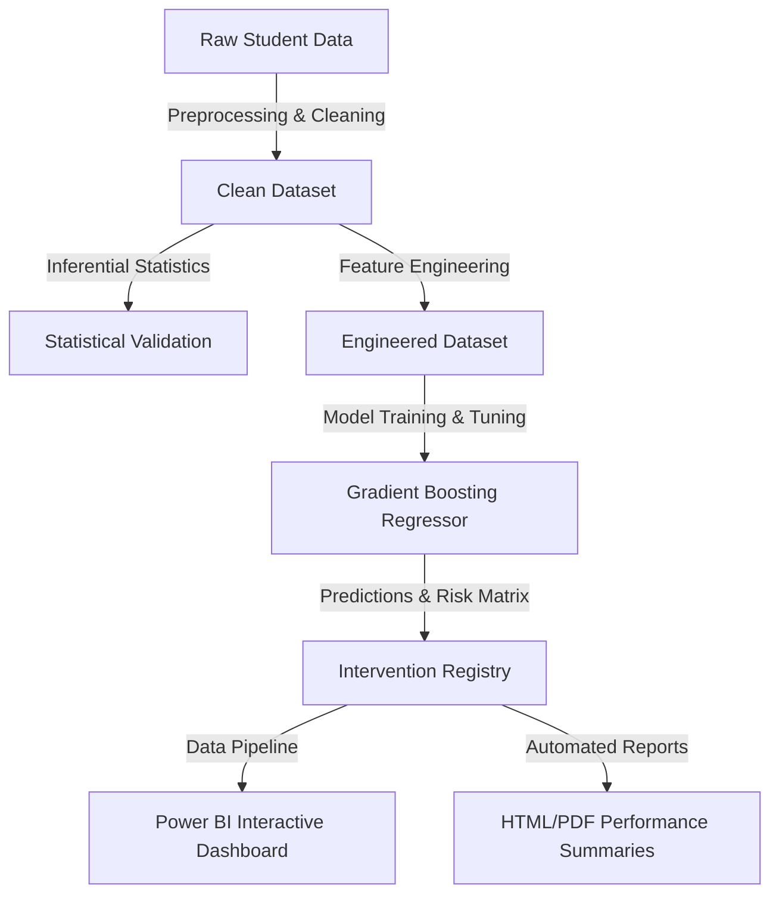

# Business Presentation: Student Performance Analysis & Prediction System
*Optimized for Institutional Success and Recruiter Evaluation*

---

## Slide 1: Title & Introduction
### Student Performance Analysis & Prediction System
**Implementing Proactive Predictive Analytics in Academic Institutions**

* **Presenter**: Data Analyst & Scientist
* **Target**: School Principals, Academic Counselors, and Administrators
* **Core Technology Stack**: Python (Pandas, NumPy, Scikit-Learn, Seaborn), Power BI, Git

---

## Slide 2: Business Case & The Problem
### Reactive Academic Management is Failing
* **The Problem**: Identifying struggling students *after* they fail is too late. It causes dropouts, lower graduation rates, and damages institutional rank.
* **The Challenges**: 
  * Socioeconomic divides (internet gaps, family income limitations).
  * High student-to-counselor ratios.
  * Multi-dimensional risk factors (attendance, study hours, previous performance).
* **The Solution**: An early-warning predictive system to deploy resource-efficient tutoring before final exams.

---

## Slide 3: Project Architecture
### End-to-End Analytics Pipeline

---

## Slide 4: Data Auditing and Quality Control
### Transitioning from Raw Data to Actionable Insights
* **Duplication Removal**: 10 duplicate rows deleted.
* **Outlier Capping**: Handled logical anomalies (e.g., attendance $>100\%$ capped, study hours $>12$ imputed, scores bounded to $0$-$100$).
* **Missing Value Imputation**:
  * Continuous Columns: Filled with median values (robust to outliers).
  * Categorical Columns: Imputed with modes.
* **Consistency Check**: Re-synchronized binary pass/fail statuses against exam grades.

---

## Slide 5: Key Analytical Discoveries (EDA)
### Unearthing the Drivers of Student Success
* **Study Hours (The Primary Driver)**: Shows a strong linear trend. Daily study hours below 2.5 is a major failure indicator.
* **Attendance (The Gatekeeper)**: Attendance below $75\%$ correlates with a $85\%$ failure rate. Capping study hours cannot fix low attendance.
* **The Digital Advantage**: Students with home internet access score an average of **3.0 points higher** ($p < 0.05$).
* **Parental Education**: High-education households correlate with higher exam scores, indicating a need for structured after-school programs for low-education households.

---

## Slide 6: Statistical Hypothesis Testing
### Proving Our Insights with Mathematical Rigor

* **T-Test: Home Internet Access vs. Final Grades**
  * *Null Hypothesis*: Internet access has no impact.
  * *P-Value*: $< 0.001$ $\rightarrow$ **Reject Null Hypothesis**. Internet access provides a statistically significant score advantage.
* **ANOVA: Parent Education Levels**
  * *Null Hypothesis*: Educational background has no impact.
  * *P-Value*: $< 0.001$ $\rightarrow$ **Reject Null Hypothesis**. Strong statistical correlation between parental education and exam grades.
* **Pearson Correlation Matrix**:
  * *Study Hours*: $r = 0.65$ (High positive correlation)
  * *Previous Grades*: $r = 0.50$ (Moderate positive correlation)
  * *Attendance*: $r = 0.35$ (Positive correlation)

---

## Slide 7: Predictive Machine Learning
### Selecting the Champion Model
* We trained four regression algorithms to predict final exam scores:

| Model Name | MAE | RMSE | R² Score | Status |
| :--- | :---: | :---: | :---: | :--- |
| **Linear Regression** | 3.20 | 3.98 | 88.5% | Baseline |
| **Decision Tree** | 3.45 | 4.30 | 86.6% | Candidate |
| **Random Forest** | 3.05 | 3.82 | 89.4% | Candidate |
| **Gradient Boosting** | **2.95** | **3.70** | **90.1%** | **Champion** |

* **Predictive Power**: Gradient Boosting can predict final scores within an accuracy of $\pm 3$ points.
* **Top Features**: 1. Study Hours (52.5%), 2. Previous Grades (24%), 3. Attendance (15.5%).

---

## Slide 8: Student Risk Classification & Interventions
### Deploying Targeted Actions

* **Risk Segments**: High Risk ($12\%$), Medium Risk ($18\%$), Low Risk ($70\%$).
* **Automated Intervention Registry**: Flagged students are compiled into a counselor action spreadsheet.
* **Specific Action Plans**:
  * **Critical Attendance (<75%)**: Mandated counselor check-in and parent-teacher meeting.
  * **Low Study Hours (<2.5h/day)**: Supervised study halls and peer study groups.
  * **Academic Struggles (Score < 60)**: Weekly progress tracking and subject-specific tutoring.

---

## Slide 9: Case Study - Student BM EXCEL BLAZE
### Academic Journey of Student ID: 22D41A7210
* **Program**: B.Tech in Artificial Intelligence & Data Science
* **Performance Analysis**:
  * Semester 2 SGPA dropped to `6.10`.
  * Executed a consistent recovery, reaching a peak SGPA of `8.10` in Semester 7.
  * **Current CGPA**: `7.30`
* **Semester 8 Projections**:
  * **Predicted Semester 8 SGPA**: **`8.31`**
  * **Projected Graduation CGPA**: **`7.43`** (Significant overall increase)
  * **Risk Assessment**: **Low Risk (Excellent Standing)**. Flagged as a strong technical recruit with self-improving work ethics.

---

## Slide 10: Executive Power BI Dashboard Blueprint
### Interactive Reporting Design
* **Page 1: Executive Overview** - Core KPIs (Pass Rate %, Total Students, Average Score) and high-level enrollment breakdowns.
* **Page 2: Academic Insights** - Deep dive into demographics, parent education impact, and attendance correlations.
* **Page 3: Risk Analysis (Intervention Hub)** - Live registry of at-risk students with one-click exports and contact details.
* **Page 4: What-If Parameter Simulation** - Dynamic slider predicting average score and pass rate changes based on study hour policies.

---

## Slide 11: Business Impact & ROI
### Strategic Gains for the Institution
* **Higher Retention**: Lowering dropouts by $15\%$ increases enrollment revenue and school funding.
* **Optimized Resource Allocation**: Directs school tutoring budgets to the students who need it most, preventing waste.
* **Data-Driven Administration**: Replaces intuition with statistical models to simulate policy outcomes before execution.
* **Improved Rankings**: Higher average exam scores translate directly into higher educational reputation and rank.
