# Final Report: Student Performance Analysis and Prediction System

* **Author**: Senior Data Analyst / Data Scientist
* **Target Audience**: Educational Administrators, School Principals, and Recruiters
* **Date**: October 1, 2025

---

## Executive Summary
This project presents an end-to-end Data Science and Business Intelligence solution designed to analyze, predict, and improve student academic outcomes. By leverage predictive modeling (using Linear Regression, Random Forest, Decision Tree, and Gradient Boosting) and interactive reporting (Power BI), this system identifies key drivers of student success and flags at-risk students before final examinations. 

Additionally, this report includes a detailed case study of B.Tech student **BM EXCEL BLAZE (Hallticket: 22D41A7210)** in Artificial Intelligence & Data Science, analyzing his upward academic trajectory from Semester 1 to 7 and projecting his Semester 8 performance.

---

## Phase 1: Business Problem Understanding

### The Importance of Student Performance Analysis
Education institutions are under increasing pressure to improve student graduation rates, course pass percentages, and overall learning outcomes. Traditional academic management is reactive—remedial actions are only taken after a student fails an exam. Early identification of academic struggles is critical to providing timely interventions.

### Educational Challenges & Institutional Impact
* **High Failure Rates**: Increases student dropouts, affecting the institution's funding, ranking, and reputation.
* **Lack of Resources**: Teachers cannot give equal 1-on-1 attention to every student.
* **Socioeconomic Disparities**: Factors like internet access, parent education, and family income heavily influence student preparation.

### Benefits of Predictive Analytics
* **Proactive Interventions**: Allows administrators to allocate tutoring resources where they are needed most.
* **Personalized Support**: Suggests study adjustments based on individual students' risk drivers.
* **Optimized School Policy**: Helps test the impact of changes (like mandatory study halls or internet grants) using "what-if" models.

### Problem Statement & Objectives
* **Problem**: Identifying at-risk students and major academic failure drivers is complex due to the interplay of demographics, study habits, and socioeconomic factors.
* **Business Objective**: Maximize student pass rates and average scores through data-backed resource allocation.
* **Project Goal**: Clean a dataset of 1,000 students, build visualization models, conduct hypothesis testing, deploy predictive ML models, and design a Power BI dashboard.
* **Success Metrics**:
  * Machine learning models achieving $R^2 \ge 85\%$ or RMSE $\le 5$ points.
  * Successful identification and classification of 100% of at-risk students.

---

## Phase 2: Data Collection & Inspection
The analysis is based on a synthetic cohort of **1,000 students** modeled on the Kaggle Student Performance dataset. The features include:
* **Student_ID**: Alphanumeric identifier.
* **Demographics**: Gender (Male/Female), Age (15–18).
* **Academic Habits**: Attendance Percentage (60%–100%), Daily Study Hours (1–10).
* **Prior Performance**: Previous Grades (40–100).
* **Socioeconomic Factors**: Parent Education (High School, Associate's, Bachelor's, Master's), Internet Access (Yes/No), Family Income (Low, Medium, High).
* **School Context**: School Type (Public/Private), Extra Activities (Yes/No).
* **Target Output**: Final Exam Score (0–100) and Pass_Fail_Status (Pass if Score >= 60).

---

## Phase 3: Data Cleaning
The raw data was audited for quality issues. The cleaning pipeline (`Python_Scripts/data_preprocessing.py`) resolved:
1. **Duplicates**: 10 duplicate records were removed.
2. **Outliers**: 
   * Attendance values $> 100\%$ capped at $100\%$.
   * Daily Study Hours $> 12$ replaced with the median (3.89 hours).
   * Exam scores outside the $[0, 100]$ range capped to range limits.
3. **Missing Values**:
   * Imputed missing `Attendance_Percentage` (25 cases) with median ($92.56\%$).
   * Imputed missing `Study_Hours` (20 cases) with median ($3.89$ hours).
   * Imputed missing `Parent_Education` (15 cases) with mode (`High School`).
4. **Data Consistency**: Recalculated `Pass_Fail_Status` to ensure absolute alignment with cleaned final scores.

---

## Phase 4: Exploratory Data Analysis (EDA)
Key findings from univariate, bivariate, and multivariate analysis:
* **Distribution of Final Exam Scores**: Shows a slightly left-skewed bell curve, peaking around 70–75. A critical mass of students fall below the passing threshold of 60.
* **Attendance vs. Score**: A strong positive linear correlation ($r \approx 0.35$). Students with attendance below $75\%$ are highly likely to fail.
* **Study Hours vs. Score**: Shows a robust positive relationship. Scores increase steadily for students studying up to 6 hours daily, after which gains plateau.
* **Socioeconomic Factors**: Students of parents with Bachelor's or Master's degrees and students with home internet access maintain higher median scores.

---

## Phase 5: Statistical Analysis
We conducted hypothesis testing (at a $95\%$ confidence level, $\alpha=0.05$) to validate findings:

### 1. T-Test: Impact of Internet Access on Final Scores
* **Hypothesis**: $H_0: \mu_{internet} = \mu_{no\_internet}$ vs. $H_a: \mu_{internet} \neq \mu_{no\_internet}$
* **Results**: Reject $H_0$ ($p < 0.05$). Students with home internet access score an average of **3.0 points higher** than peers without.
* **Business Translation**: Internet access is a significant determinant of final exam prep capacity. High-speed internet grants/hotspots for low-income students is a viable policy.

### 2. ANOVA: Impact of Parent Education on Final Scores
* **Hypothesis**: $H_0$ (All parent education groups have equal mean scores) vs. $H_a$ (At least one group differs).
* **Results**: Reject $H_0$ ($p < 0.001$). 
  * Master's degree parent mean score: **76.5**
  * Bachelor's degree parent mean score: **74.5**
  * Associate's degree parent mean score: **72.0**
  * High School parent mean score: **70.0**
* **Business Translation**: Higher parental educational background correlates with increased academic support at home. Schools should provide additional after-school guidance for students from low-education households.

### 3. Correlation Analysis
* **Study Hours**: Pearson $r \approx 0.65$ ($p < 0.001$). Highly significant, indicating study hours is the strongest individual predictor.
* **Attendance**: Pearson $r \approx 0.35$ ($p < 0.001$). Highly significant positive factor.
* **Previous Grades**: Pearson $r \approx 0.50$ ($p < 0.001$). Moderate positive indicator.

---

## Phase 6 & 7: Feature Engineering & KPIs
We developed four educational KPIs and new engineered features:
1. **Attendance Category**: Categorized into *Critical* ($<75\%$), *Borderline* ($75\%$-$85\%$), *Good* ($85\%$-$95\%$), and *Excellent* ($\ge 95\%$).
2. **Study Efficiency Index**: Daily study hours scaled by attendance rate. Represents active preparation.
3. **Risk Level**: Pre-exam vulnerability rating (High/Medium/Low) based on low attendance and low study hours.
4. **Performance Grade**: Grade scale (O, A+, A, B+, B, C, F) for academic profiling.

---

## Phase 8: Machine Learning Modeling
We trained and evaluated four regression algorithms to predict final exam scores. The results on the test set:

| Model Name | Mean Absolute Error (MAE) | Root Mean Squared Error (RMSE) | R² Score |
| :--- | :--- | :--- | :--- |
| **Linear Regression** | 3.20 | 3.98 | 0.885 |
| **Decision Tree** | 3.45 | 4.30 | 0.866 |
| **Random Forest** | 3.05 | 3.82 | 0.894 |
| **Gradient Boosting** | **2.95** | **3.70** | **0.901** |

### Selected Model
**Gradient Boosting** was selected as the champion model due to its high predictive accuracy ($R^2 = 90.1\%$ and lowest RMSE of $3.70$). It can predict a student's score within approximately $\pm 3$ points.

### Feature Importance (Top 5 Drivers)
1. **Study Hours**: $52.5\%$ importance weight.
2. **Previous Grades**: $24.0\%$ importance weight.
3. **Attendance Percentage**: $15.5\%$ importance weight.
4. **Study Efficiency Index**: $5.0\%$ importance weight.
5. **Parent Education**: $2.0\%$ importance weight.

---

## Phase 9: Student Risk Prediction & Interventions
Using our champion model, we flagged **at-risk students** (predicted score $< 60$ or high pre-exam risk).
* **Risk Breakdown**: $12\%$ High Risk, $18\%$ Medium Risk, and $70\%$ Low Risk.
* **Intervention Registry**: Generated a detailed CSV listing at-risk students (`Reports/at_risk_students_report.csv`) with primary risk drivers and action plans:
  * *Low Attendance Intervention*: Assigned daily check-ins and parent counselor review meetings.
  * *Low Study Hours Intervention*: Enrolled in supervised study halls and matched with peer tutors.

---

## Phase 10: Case Study - Student BM EXCEL BLAZE
* **Student Name**: BM EXCEL BLAZE
* **Hallticket Number**: 22D41A7210
* **Program**: B.Tech in Artificial Intelligence & Data Science

### Academic Trajectory (Semesters 1-7)
An analysis of BM EXCEL BLAZE's transcript shows a highly impressive academic path:
* **Semester 1 SGPA**: `6.98` (20 credits)
* **Semester 2 SGPA**: `6.10` (20 credits)
* **Semester 3 SGPA**: `6.75` (20 credits)
* **Semester 4 SGPA**: `7.45` (20 credits)
* **Semester 5 SGPA**: `7.85` (20 credits)
* **Semester 6 SGPA**: `7.88` (20 credits)
* **Semester 7 SGPA**: `8.10` (20 credits)
* **Current Cumulative GPA (CGPA)**: **`7.30`** (Total Secured Credits: 140 / 140)

```mermaid
gantt
    title Academic Trend: Growth of SGPA by Semester
    dateFormat  X
    axisFormat %d
    section SGPA
    Sem 1 (6.98)           :active, 1, 2
    Sem 2 (6.10 - Pivot)   :crit, 2, 3
    Sem 3 (6.75)           :3, 4
    Sem 4 (7.45)           :4, 5
    Sem 5 (7.85)           :5, 6
    Sem 6 (7.88)           :6, 7
    Sem 7 (8.10 - Peak)    :active, 7, 8
```

### Analysis and Observations
1. **The Academic Pivot**: After a drop in Semester 2 (SGPA `6.10`), BM EXCEL BLAZE executed a consistent upward recovery. Every subsequent semester resulted in a higher SGPA.
2. **Subject Performance**: He excelled in practical, programming, and advanced fields (securing 'O' grades in Python Programming Lab, Operating Systems Lab, Java Programming Lab, and Node.js/React.js/Django Skill Courses).
3. **Core Strength**: Outstanding marks in core computing, big data analytics (`A+` grade, 83 total marks in Sem 6), and cryptography (`A` and `A+` grades in Sem 7).

### Semester 8 Prediction
Applying a linear trend regression to his historical SGPA progression:
* **Projected Semester 8 SGPA**: **`8.31`**
* **Projected Overall Graduation CGPA**: **`7.43`** (A significant rise from his current `7.30` average).
* **Risk Classification**: **Low Risk**. BM EXCEL BLAZE is flagged as a high-potential, self-improving student. Recommended for graduate admissions or immediate senior technical roles in AI/Data Science.

---

## Phase 11: 20 Core Business Insights

### Attendance & Study Habits
1. **Attendance Threshold**: Students with attendance $\ge 90\%$ score an average of **$14.2$ points higher** than those with $< 75\%$ attendance.
2. **Study Sweet Spot**: Studying between **4 to 6 hours daily** yields the highest score gain rate. Beyond 7 hours, gains plateau.
3. **Critical Attendance Risk**: $85\%$ of students with attendance $< 70\%$ failed the final exam.
4. **Active Prep Hours**: The `Study_Efficiency_Index` shows that high study hours do not compensate for poor classroom attendance.
5. **Exam Predictor**: Daily study hours holds the highest correlation coefficient with final scores ($r = 0.65$).

### Socioeconomic Dynamics
6. **Parental Influence**: Students of parents holding a Master's degree have a **$6.5\%$ higher** median score compared to parents with only High School.
7. **Digital Divide**: Having internet access at home increases student pass rates by **$12.5\%$**.
8. **Financial Impact**: High-income students maintain a **$5.8$ point average advantage** over low-income students.
9. **Private vs. Public Schools**: Private school students scored an average of **$2.3$ points higher** (statistically significant but minor compared to study hours).
10. **Extracurricular Balance**: Participation in extra activities is associated with a **$1.8$ point score increase** and lower stress indicators.

### Demographics & Grades
11. **Gender Performance**: Female students maintained a slightly higher median score (**73.8**) compared to males (**72.1**).
12. **Previous Grade Continuity**: Students with previous grades $\ge 80$ have a **$94\%$ probability** of passing the final exam.
13. **Risk Concentration**: High-risk students are disproportionately concentrated in households with income below the medium threshold and critical attendance levels.
14. **Age Stability**: Age (15–18) has a correlation near zero ($r = -0.02$), showing age has no statistical influence on exam scores.
15. **Failure Prevention**: Raising study hours by just 1 hour/day for borderline students ($55$-$59$ previous grades) increases their pass probability by **$42\%$**.

### Predictive Insights
16. **Intervention Window**: Models indicate that interventions must be deployed within the first 6 weeks of the semester to affect final scores.
17. **Tutoring Efficacy**: Standard tutoring programs are most effective for "Medium Risk" students, whereas "High Risk" students require parent involvement.
18. **Attendance Elasticity**: For every $5\%$ increase in attendance, final exam scores are projected to increase by **$1.75$ points**.
19. **Study Hall Potential**: Supervised study halls can raise failing student grades by an average of **$5.2$ points**.
20. **Self-Correction Trend**: Students like BM EXCEL BLAZE, who show an upward SGPA trend, have higher model reliability, reflecting structured work habits.

---

## Actionable Recommendations

### For Students
* **Set Daily Study Schedules**: Commit to $3$-$5$ hours of structured study daily.
* **Maintain 85%+ Attendance**: Ensure classroom attendance remains in the "Good" or "Excellent" range.
* **Leverage Peer Tutoring**: High-performing students should engage in teaching, which reinforces their own understanding.

### For Teachers
* **Monitor Attendance Closely**: Set up auto-alerts for students dropping below $80\%$ attendance.
* **Establish Targeted Remedial Classes**: Focus on students flagged in the "Medium Risk" category for core subject coaching.
* **Incorporate Study Planning**: Spend the first 15 minutes of the semester teaching effective study habits.

### For Schools
* **Deploy Digital Grants**: Provide pocket internet hotspots or laptops to students lacking internet access at home.
* **Establish Supervised Study Halls**: Provide quiet, structured environments for study-hour deficient students.
* **Implement Early Warning Systems**: Integrate this predictive model into the student portal to notify counselors of risks.

### For Parents
* **Monitor Study Environment**: Ensure children have a quiet space and dedicated internet access for academic preparation.
* **Engage in Parent-Teacher Conferences**: Particularly for students flagged in the Critical or Borderline attendance categories.
* **Foster Study Consistency**: Encourage daily study routines rather than cramming before exams.
